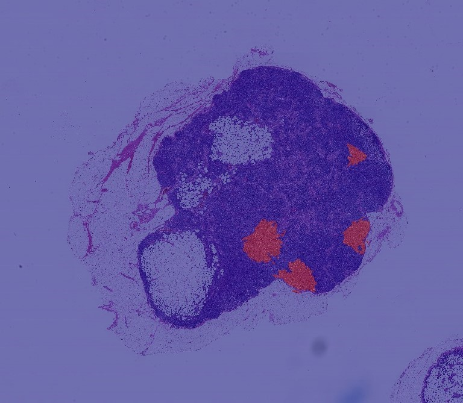
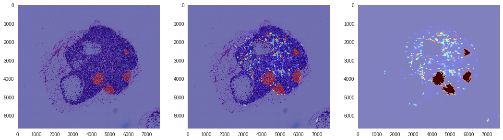
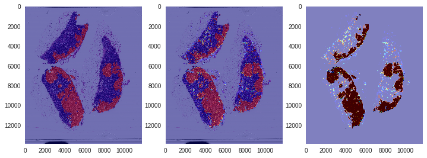

# Project: Tumor Detection

Term: Fall 2018

- Project title: Tumor Detection on Gigapixel Pathology Images

- Team members

  - Li, Hongyu hl3099@columbia.edu
  - Yang, Fan fy2232@columbia.edu

- Project summary: In this project, we used the idea of transfer learning to detect tumor on gigapixel pathology images. Our final model performs well both on training slide(`tumor_091.tif`) and a random test slide(`tumor_078.tif`). What’s more, in the process of tuning, we also found that: (1) the smaller window size, center size and stride are, the more subtle result we could get; (2) resampling and data augmentation play an important role for detection when our dataset is extremely imbalanced. In our task, augmenting all data is better than augmenting tumor patches only because it did not sacrifice true negative rate so much; (4) it’s worthy to do foreground preprocess before training a model which could help us improve the model’s ability of generalization; (5) multi-scale model cannot outperform single-scale model because it would take a long time to train and its results are not subtle.  Our final results are shown as below.

  

   

## For this project we provide: 

  - Notebook (`final_model.ipynb`) that shows our final model and its results. 
  - A File(`final_model.h5`) that stores our final model weights.
  - [A supplementary report](./Tumor Detection on Gigapixel Pathology Images.pdf) that describes our workflow, tuning process and results.

## References:

[1] Detecting Cancer Metastases on Gigapixel Pathology Images.

[2] Development and Validation of a Deep Learning Algorithm for Detection of Diabetic Retinopathy in Retinal Fundus Photographs. 

[3] Identifying Metastatic Breast Cancer Using Deep Texture Representation. 